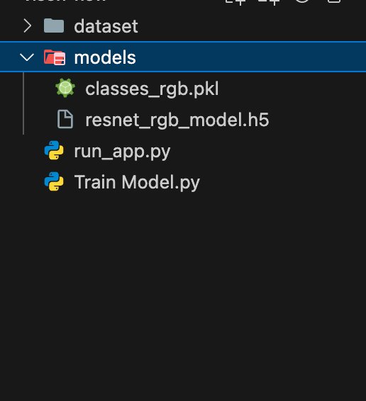

# Sign Language to Communicate with People with Disabilities

This project uses a ResNet50 model to recognize American Sign Language (ASL) characters from a webcam feed.

## Prerequisites

Ensure you have Python installed (Python 3.9+ recommended).

Install the required dependencies:

```bash
python3 -m pip install -r setup.txt

```

## Dataset and Models

please download the dataset and pre-trained models from the following Google Drive link:
[Download Models and Dataset](https://drive.google.com/drive/folders/1IYqvwjuZjqibtFlOR7VUm7OzBLQ-Lxz6?usp=sharing)

## Presentation

Project presentation :
[View Presentation](https://docs.google.com/presentation/d/19fm19EvjPBaC-GOkvzxcejNifA9LI9KXStbVtf67ico/edit?usp=sharing)

## Project Report

Project report :
[View Report](https://docs.google.com/document/d/15-RLz2UakyQvDs9GF8MiAFJCB7N3VSllJfNzghdjnIg/edit?tab=t.lhmo94lfmnnj#heading=h.yct7mjd62frj)

## Directory Structure

Ensure your project directory looks like this:



## How to Run

### 1. Train the Model (Optional)

If you haven't trained the model yet or want to retrain it:

```bash
python "Train Model.py"
```

This will train the model using the images in the `dataset` folder and save the model and class labels to the `models` folder.

### 2. Run the Application

To start the real-time sign language recognition app:

```bash
python run_app.py
```

### Application Instructions

- **Place hand in the green box**: Position your hand within the green rectangle on the screen.
- **Hold hand still for 0.5s**: The application requires the hand to be stable to register a character.
- **Press 'R'**: Clear the current text.
- **Press 'Q'**: Quit the application.
